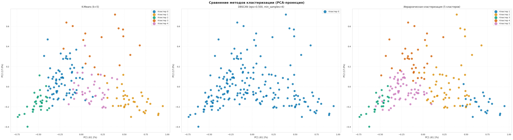
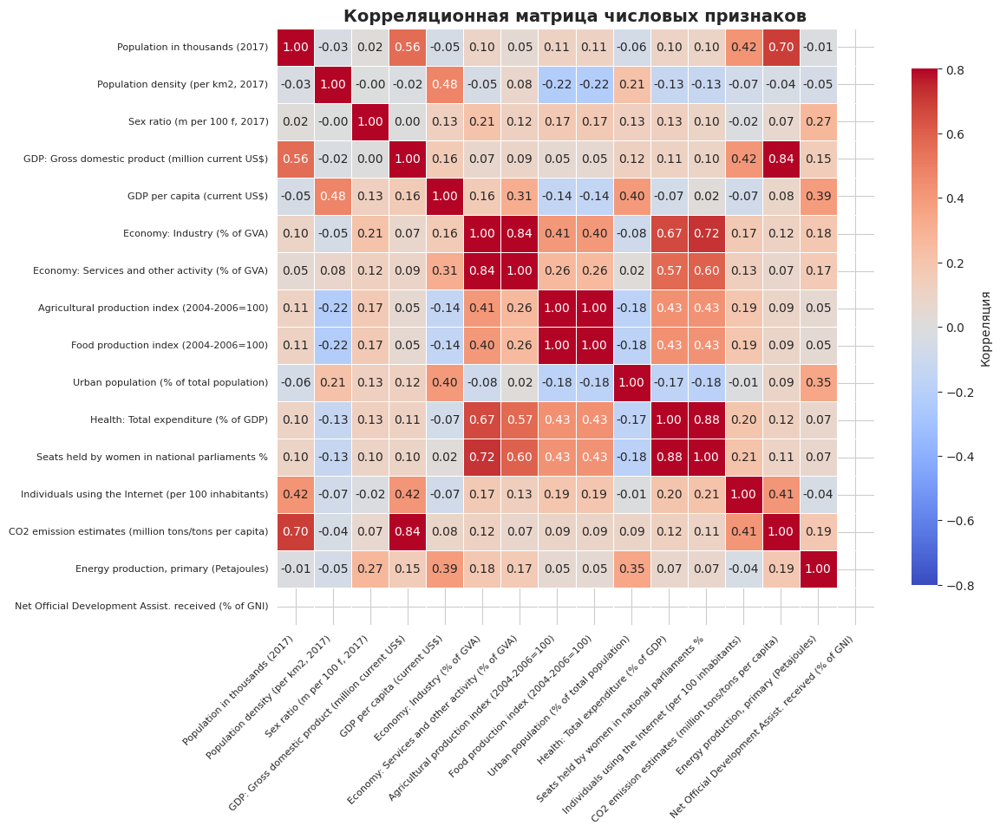
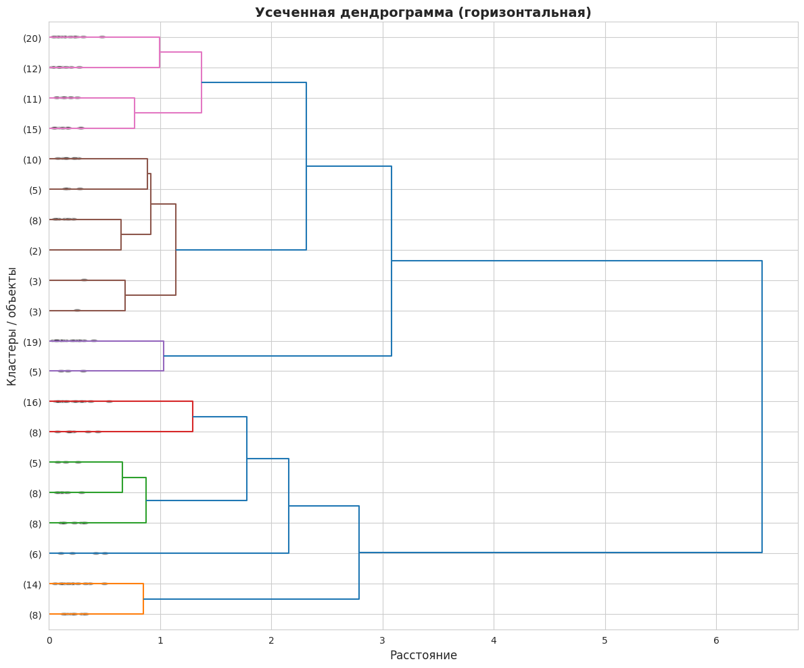
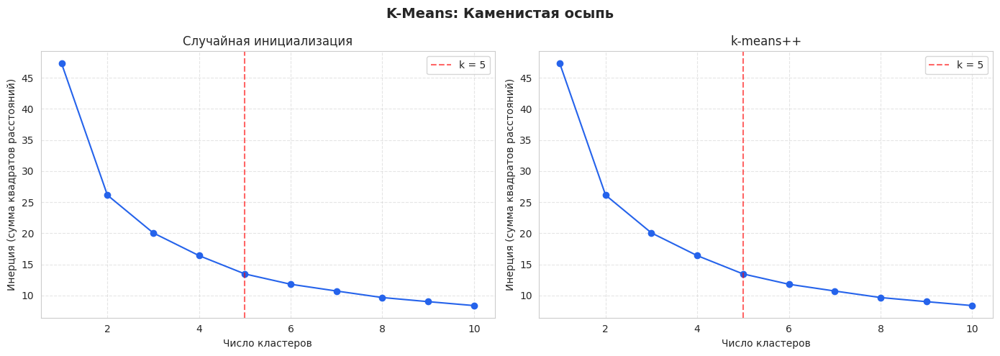
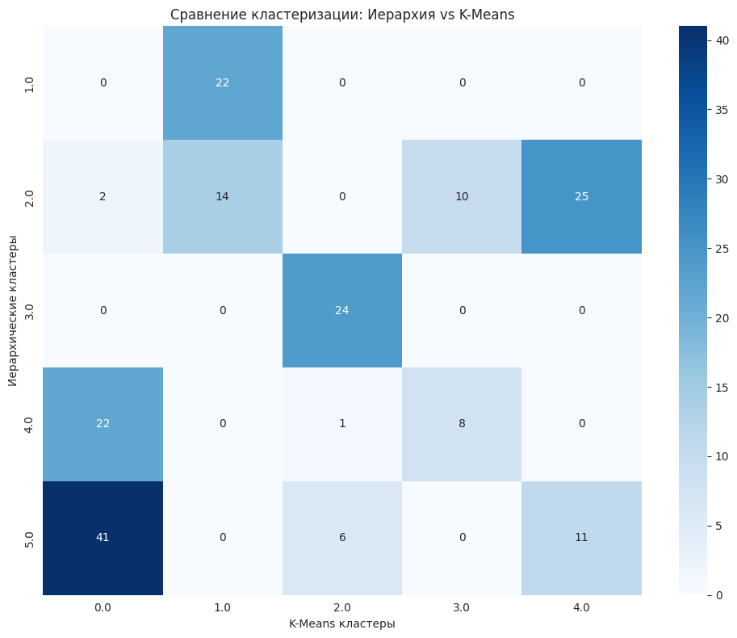
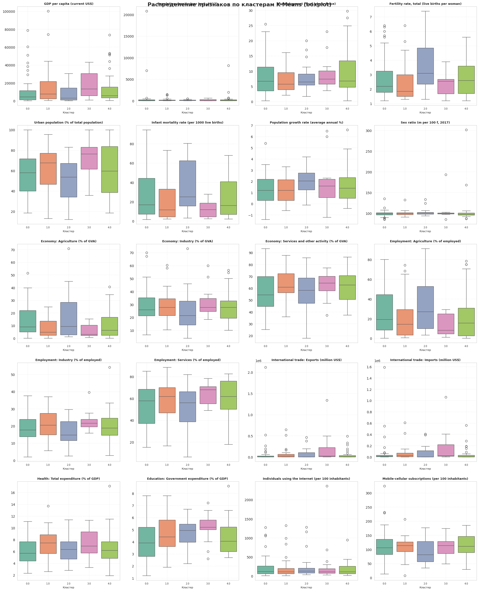
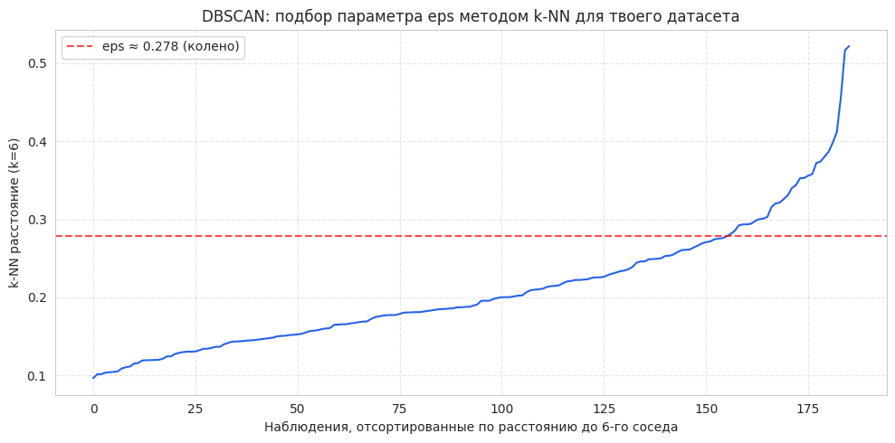
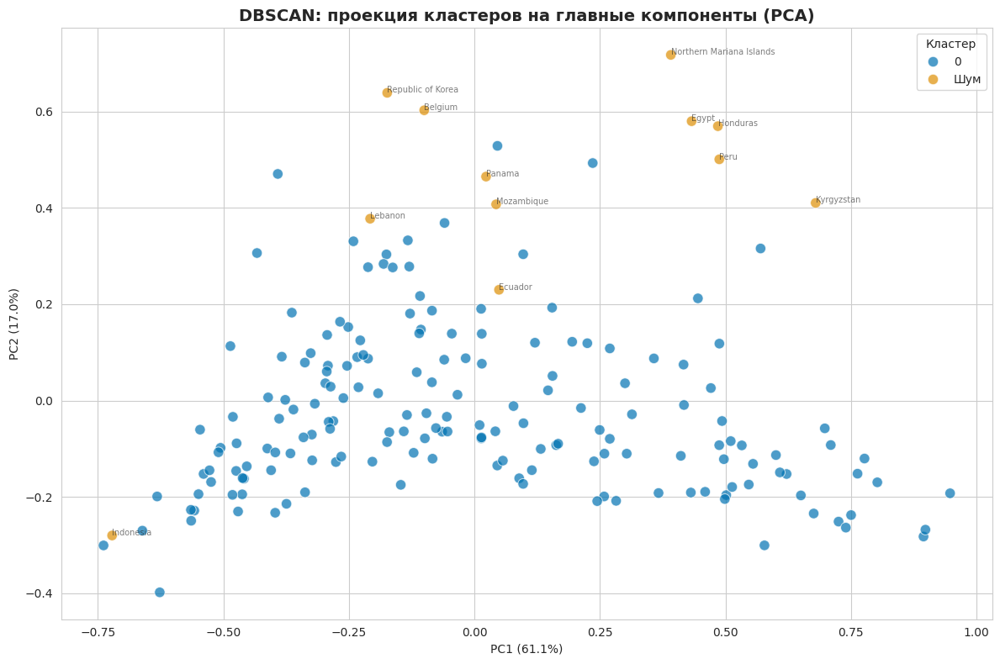

# 🌍 Cluster Analysis of Countries

**Unsupervised machine learning project that groups 186 countries into socio-economic clusters** using UN development indicators — comparing Hierarchical Clustering, K-Means, and DBSCAN.

[](https://www.python.org/)
[](https://scikit-learn.org/)
[](https://pandas.pydata.org/)
[](https://jupyter.org/)
[](LICENSE)

[Русская версия](README.ru.md)



## 📌 Overview

This project explores whether countries naturally group into meaningful socio-economic tiers (e.g. low-income agrarian, emerging, industrial, high-income) using only quantitative development data — no labels, no assumptions about region or continent.

Three clustering algorithms are implemented, tuned, and cross-validated against each other:

| Method | How the number/shape of clusters is chosen |
|---|---|
| **Hierarchical (Ward linkage)** | Dendrogram inspection + distance-jump ("elbow") analysis |
| **K-Means** | Elbow method on inertia, comparing random vs. `k-means++` initialization |
| **DBSCAN** | `eps` selected automatically via k-NN distance plot + Kneedle-style knee detection |

Results are validated with **Silhouette**, **Calinski-Harabasz**, and **Davies-Bouldin** scores, and visualized in 2D via **PCA** and **MDS**.

## 🗂️ Dataset

- **Source:** UN Statistics Division — *World Statistics Pocketbook* ([`country_profile_variables.csv`](data/country_profile_variables.csv), 229 countries × 53 indicators)
- **Cleaning:** `-99` sentinel values converted to `NaN`; rows with missing data in the clustering features dropped → **186 countries** retained
- **Features used for clustering** (Min-Max normalized):
  - GDP per capita (current US$)
  - Population density (per km²)
  - Unemployment (% of labour force)
  - Fertility rate (live births per woman)
  - Urban population (% of total population)
  - Infant mortality rate (per 1000 live births)

See [`data/README.md`](data/README.md) for details.

## 🔬 Methodology

1. **Load & clean** the UN dataset, fix the infant-mortality column name, handle `-99` missing-value codes
2. **Feature selection & Min-Max normalization** of the six indicators above
3. **Hierarchical clustering (Ward)** — build the full linkage tree, plot a truncated dendrogram, pick `k=5` from the distance-jump plot
4. **K-Means** — run `k = 1..10`, compare random vs. `k-means++` init via the elbow method, fit final model at `k=5`
5. **Cross-validate** Hierarchical vs. K-Means with a confusion-matrix heatmap (84–95% agreement on 4 of 5 clusters)
6. **Cluster profiling** — mean/std per feature per cluster, boxplots to spot within-cluster spread and outliers
7. **Dimensionality reduction** — project clusters onto 2D with PCA (78.1% explained variance) and MDS for visual validation
8. **DBSCAN** — estimate `eps` from the k-distance graph (knee detection), sweep parameters, and show why density-based clustering fails on this continuous, non-clustered feature space
9. **Quantitative comparison** of all three methods using internal validation metrics

## 📊 Results

| Method | Silhouette ↑ | Calinski-Harabasz ↑ | Davies-Bouldin ↓ |
|---|---|---|---|
| **K-Means (k=5)** | **0.307** | **114** | **1.057** |
| Hierarchical (Ward, k=5) | 0.244 | 94 | 1.185 |
| DBSCAN | -1.00* | -1* | -1* |

\* *DBSCAN collapses the entire dataset into a single cluster (plus noise points) across the tested parameter range — evidence that country development indicators form a **continuum** (a gradual poor → rich gradient) rather than dense, well-separated groups. This itself is a meaningful finding, not a failure of the method.*

**Key takeaway:** K-Means and Hierarchical clustering agree on 4 of 5 clusters, identifying recognizable socio-economic tiers (high-income developed nations, industrializing economies, transitional/middle-income countries, and lower-income agrarian economies), with the main disagreement isolated to a transitional group of upper-middle-income countries.

<details>
<summary><strong>📈 More charts (click to expand)</strong></summary>

**Feature correlation matrix**



**Ward dendrogram (truncated)**



**K-Means elbow method — random vs. k-means++ init**



**Hierarchical vs. K-Means agreement**



**Cluster separation — PCA & MDS**



**DBSCAN `eps` selection via k-NN distance / knee detection**



**DBSCAN result — one dominant cluster + noise/outlier countries**



</details>

## 🚀 Getting started

```bash
git clone https://github.com/nokio7077-art/cluster-analysis-of-countries.git
cd cluster-analysis-of-countries

python -m venv .venv
source .venv/bin/activate      # Windows: .venv\Scripts\activate
pip install -r requirements.txt

jupyter notebook notebooks/cluster_analysis.ipynb
```

The notebook reads `data/country_profile_variables.csv` — run cells from the top in order.

## 📁 Project structure

```
cluster-analysis-of-countries/
├── data/
│   ├── country_profile_variables.csv   # raw UN dataset
│   └── README.md                       # dataset notes
├── images/                             # exported charts used in this README
├── notebooks/
│   └── cluster_analysis.ipynb          # full analysis, runnable end-to-end
├── requirements.txt
├── LICENSE
└── README.md
```

## 🛠️ Tech stack

`pandas` · `numpy` · `scikit-learn` (KMeans, DBSCAN, PCA, MDS, metrics) · `scipy` (hierarchical clustering) · `matplotlib` / `seaborn` (visualization)

## 📄 License

Released under the [MIT License](LICENSE).

---

*Student project — cluster analysis of countries by socio-economic indicators.*
